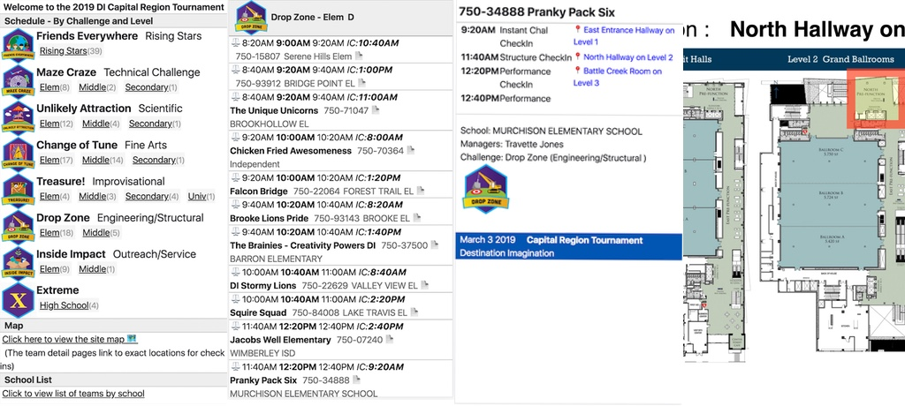

# Generator for DI Event Schedule and Map

This project was originally created for the 2018 Destination Imagination Capital Region Tournament, and the goal is to make this generic enough to leverage for any DI tourney.  It generates a set of static HTML pages for a tournament schedule and map.  The document links below are for more detail.

 - [App Overview](docs/README-site.md)
 - [Generation Process Overview](docs/README-process.md)

.

## Features
- **Data-Driven** : No coding required, just edit CSV files and images.
- **Responsive** : Designed for phone, tablet, desktop screens.
- **Low-Cost to Host** : Doesn't require any special web hosting (no database or server runtime).
- **No App Install Needed** : When people arrive at an event, they usually don't have time to download and install an iOS or Android app to find their schedule and rooms.

## Data Files
All of the CSV files are sample data, and should be customized for your event.  The map image example used here was freely available on the web, and should be replaced by your own.

- **challenges.csv** : Maps challenge names and icon files. Should be able to use as-is after yearly update.
- **strings.json** : Update Date and Region Name.
- **schedfinal.csv** : This is the main data file.  It contains a row for each team, their scheduled times for challenges.  The room assignments are placeholder aliases.
- **room_assignments.csv** : Lists the actual rooms used, as well as the map coordinates for each.
- **images/map.jpg** : Update this with the map image (can be GIF, PNG, JPG) for your own venue.  Actual filename specified in strings.json.

## Installing Node.js Runtime Dependency

First you need to install Node/npmjs dependency.

Visit [npmjs.com downloads](https://www.npmjs.com/get-npm) and click on the 'Download node.js and npm' button.  

## Running the service

After that is Node.js is installed, double-clicking on the **run-windows.bat** (on windows) or **run-mac.command** (on MacOS) script will open up a terminal window and run a small web server that your browser can interact with.

## Interacting with the generator service

One the service is running, you set your browser to [http://localhost:8080/](http://localhost:8080/).

You should see the simple page with a single button like the following.

## Generating the HTML files

Clicking the 'Generate' button will produce the files in the **output** subdirectory.  You can immediately see the results in your browser and click links to navigate between pages exactly how your users will be doing.

## Hosting

Transfer the files in the output directory to your hosting server.  This is typically done using SFTP (Secure FTP), FTP, or using a file-manager utility in your admin control panel.

You could also use [GitHub Pages](https://pages.github.com) to host it for free.  Two things to consider:
 - **git** can be confusing if you are not a developer.
 - The URL for your site will be **something.github.io**.

For about $30, you can get a domain (e.g. 'txdi18.com') and a month of hosting at [Network Solutions](https://www.networksolutions.com).  For a longer period, there are cheaper alternatives.
